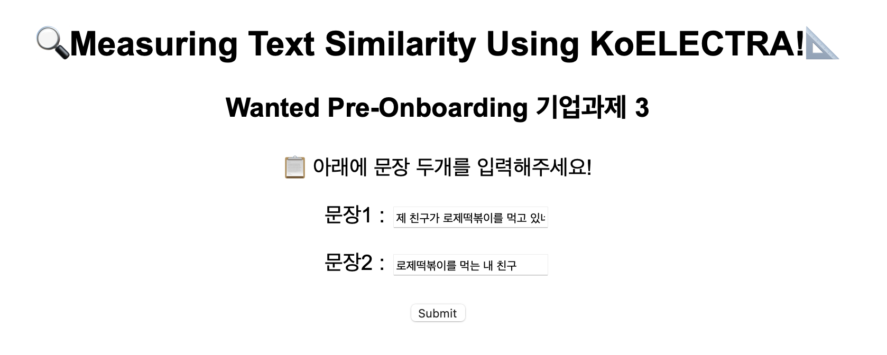
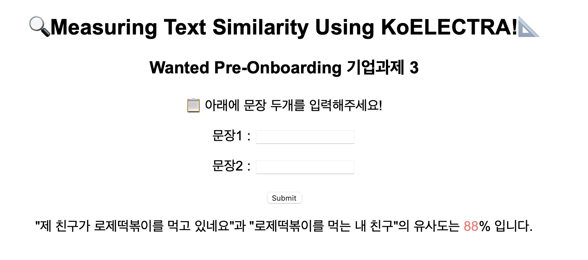

# [기업과제3] 텍스트 유사도(STS)를 알려주는 API
* 본 API는 원티드 프리온보딩 코스의 기업과제 3번 수행을 위해 제작되었습니다.
* model : [KoELECTRA](https://github.com/monologg/KoELECTRA)중 koelectra-base-v3-discriminator(pre-trained model)을 fine-tuning한 모델입니다. 
* fine-tuning에는 [KLUE-STS](https://klue-benchmark.com/tasks/67/overview/description) 의 train data를 사용하였습니다.

## Updates
**March 23, 2022**
* initial commit 

## How to run
```bash
$ pip install -r requirements.txt
$ python main.py
```
실행 후, http://127.0.0.1:5000/ (혹은 localhost)로 접속   

박스안에 문장 두개를 입력하고 submit 해줍니다.


## Directory structure
```bash
├── images
├── running_model
│   ├── best_model
│   │   ├── config.json
│   │   └── pytorch_model.bin
│   ├── data_preprocessing.py
│   └── models.py
├── templates
│   ├── index.html
│   └── result.html
├── main.py
├── README.md
└── requirements.txt
``` 
* running_model : fine-tuning된 best_model과 model을 실행하는데 필요한 모듈을 포함합니다. 
* models.py : model함수로 모델을 실행하여 두개의 문장에 대해 유사도를 구합니다. 
* data_preprocessing.py : 받은 두개의 문장에 대해 전처리를 진행하는 모듈입니다. 


## Requirements
```
Flask==2.0.3
huggingface-hub==0.4.0
tokenizers==0.11.6
torch==1.11.0
transformers==4.17.0
```
## Score (at [KLUE sts dev set](https://klue-benchmark.com/tasks/67/data/description))
- Pearson's r (0~5 continuous similarity): 0.933
- F1 Score(for binary classification): 0.867

## Our team
|  |  |  |
|:--------:|:---------:|:---------:|
| [류제성](https://github.com/crosstar1228) | [원재성](https://github.com/Woodywarhol9) | [장진희](https://github.com/zzhenxi) |
| 모델 조사 및 데이터 전처리| 모델 조사 및 구현, fine-tuning | 모델 조사 및 구현, rest api 구현
